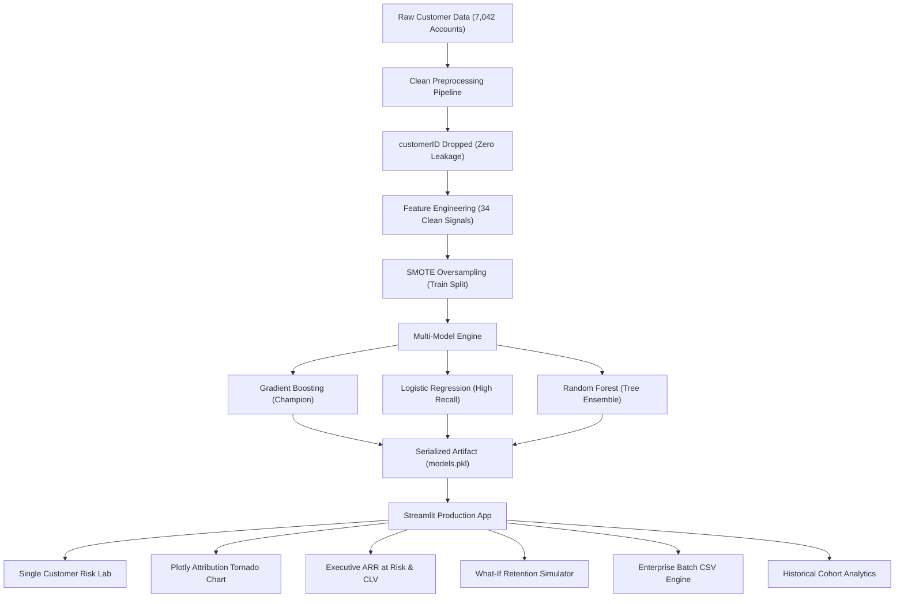

# 🎯 Customer Churn Predictor: Enterprise Decision Intelligence Platform

An enterprise-grade machine learning platform for customer churn risk prediction, local & global feature attribution, executive financial exposure analytics, counterfactual retention simulation, and high-throughput batch scoring.

[](https://python.org)
[](https://customer--churn-predictor.streamlit.app/)
[](https://scikit-learn.org)
[](https://plotly.com)
[-2088FF?style=flat&logo=github-actions&logoColor=white)](https://github.com/bipulhstu/Customer_Churn_Predictor/actions)
[](LICENSE)

---

## 🌐 Live Cloud Deployment

Access the production application:
**🔗 [https://customer--churn-predictor.streamlit.app/](https://customer--churn-predictor.streamlit.app/)**

The platform is continuously monitored and kept alive 24/7 by an autonomous GitHub Actions Playwright bot to prevent cloud sleep.

---

## 🏗️ System Architecture & Dataflow



---

## 📊 Model Performance Benchmarks

All models are trained with `SMOTE` class balancing on the stratified training holdout and evaluated on the untouched 20% test split (1,409 accounts):

| Model | Role / Specialization | Accuracy | AUC-ROC | Recall (Sensitivity) | Precision | F1-Score |
| :--- | :--- | :---: | :---: | :---: | :---: | :---: |
| **Gradient Boosting** | **Champion Model** (Balanced precision and recall) | **77.8%** | **0.842** | **66.6%** | **57.0%** | **0.614** |
| **Logistic Regression** | **High Sensitivity** (Catches maximum churners) | 74.3% | **0.844** | **79.1%** | 51.0% | **0.621** |
| **Random Forest** | **Tree Ensemble** (Complex feature interactions) | 77.2% | 0.844 | 72.2% | 55.4% | **0.627** |

> [!TIP]
> **Why Recall Matters Most in Churn Prediction**: In telecom and subscription businesses, missing an at-risk customer (False Negative) results in permanent recurring revenue loss, whereas sending a proactive retention offer to a loyal customer (False Positive) carries minimal cost. Logistic Regression delivers **79.1% Recall**, catching nearly 8 out of 10 churning customers!

---

## 🚀 Key Platform Features

### 1. 🎯 Single Customer Risk Lab & Dynamic Model Selector
- Switch between **Gradient Boosting**, **Logistic Regression**, and **Random Forest** in real time via the sidebar.
- Live benchmark metric cards display the active model's test holdout AUC, Recall, Accuracy, and Precision.
- Calibrated **4-Tier Risk Badging System**:
  - `Low Risk (<30%)`: Emerald Green (`Stable & Loyal Account`)
  - `Moderate Risk (30-60%)`: Amber (`Needs Service Review`)
  - `High Risk (60-80%)`: Orange (`Retention Incentive Needed`)
  - `Critical Risk (≥80%)`: Crimson Red (`Urgent 24-Hour Outreach Required`)

### 2. 🔍 Feature Attribution & Explainability Engine
- **Plotly Horizontal Diverging Tornado Chart**: Explains the exact mathematical drivers behind each customer's risk score.
  - 🔴 **Top Risk Drivers**: Positive contributors pushing churn probability up (e.g., Short Tenure, No Two-Year Contract, Electronic Check Billing, High Monthly Charges).
  - 🟢 **Top Protective Factors**: Negative contributors keeping the customer loyal (e.g., Two-Year Contract, Active Tech Support, Online Security, Auto-Pay Billing).
- **Context-Aware Intelligent Labels**: Automatically translates raw dummy flags into human customer states (e.g. `No Two-Year Contract` instead of `Contract_Two year = 0`).
- **Global Feature Importance**: Interactive explorer displaying the Top 10 most influential features across all 7,042 accounts.

### 3. 💵 Executive Financial Impact & Revenue at Risk
- Quantifies financial exposure for every account:
  - **Annual Recurring Revenue (ARR)**: Baseline contracted spend ($\text{Monthly Charges} \times 12$).
  - **ARR at Risk**: Annual recurring revenue in jeopardy:
    $$\text{ARR at Risk} = \text{Monthly Charges} \times 12 \times P(\text{Churn})$$
  - **Projected 3-Year CLV**: Projected lifetime revenue under retention ($\text{Monthly Charges} \times 36$).

### 4. 🔄 Interactive "What-If" Counterfactual Retention Simulator
- A real-time scenario laboratory enabling customer success teams to test intervention levers before picking up the phone:
  - 📝 **Contract Upgrade**: Month-to-month ➡️ 1-Year or 2-Year Contract.
  - 🛡️ **Care & Security Bundle**: Adding Tech Support, Online Security, and Online Backup.
  - 💳 **Billing Migration**: Moving customer from Electronic Check to Auto-Pay Credit Card.
  - 💰 **Loyalty Retention Discount**: Testing $0 to $30/mo discount adjustments.
- **Real-Time Outcome Comparison**: Computes simulated churn risk drop (e.g. **59.5% ➡️ 13.7%**, a **-45.9% reduction**) and **Net Annual Revenue Protected ($)**.
- **Frontline Agent Playbook**: Generates an automated talking points pitch script for the retention representative.

### 5. 📁 Enterprise Batch CSV Scoring & Export
- Drag-and-drop CSV uploader supporting standard customer schemas.
- **Downloadable Sample CSV Template** (`telecom_batch_template.csv`).
- **One-Click Quick Demo** scoring 25 real customer accounts from the repository.
- **Vectorized High-Speed Batch Inference**: Computes churn probabilities, risk tiers, and ARR at risk in milliseconds.
- **Executive Batch Summary KPIs**: Total Accounts Scored, Mean Risk %, Total ARR at Risk ($), Priority Targets Count.
- **Interactive Visualizations**: Plotly Donut Chart of Risk Tiers and Top 5 Revenue-Endangered Accounts.
- **One-Click Export**: Download the enriched retention target list as CSV (`scored_retention_targets.csv`).

### 6. 📊 Historical Telecom Cohort Intelligence
- Interactive exploratory data analysis across all 7,042 historical customer accounts:
  - **Contract Cohorts**: Month-to-month (42.7% churn) vs. 2-Year (2.8% churn).
  - **Internet Service Cohorts**: Fiber Optic (41.9% churn) vs. DSL (19.0% churn) vs. No Internet (7.4% churn).
  - **Payment Method Cohorts**: Electronic Check (45.3% churn) vs. Auto Credit Card (15.2% churn).
  - **Monthly Spend vs. Tenure**: Interactive Plotly scatter plot colored by churn status.

---

## 🛠️ Project Structure

```
Customer_Churn_Predictor/
│
├── .github/workflows/
│   └── keep_alive.yml               # Autonomous GitHub Actions uptime monitor
├── .streamlit/
│   └── config.toml                  # Streamlit dark theme configuration
├── Customer_Churn_Predictor.ipynb   # Exploratory Jupyter notebook
├── app.py                           # Enterprise Streamlit application
├── train_models.py                  # Multi-model training and attribution pipeline
├── models.pkl                       # Multi-model bundle (models, metrics, directions)
├── churn_model.pkl                  # Production champion model
├── scaler.pkl                       # Clean 34-feature StandardScaler
├── churn_data.csv                   # Historical churn status dataset
├── customer_data.csv                # Historical customer demographics dataset
├── internet_data.csv                # Historical internet services dataset
├── requirements.txt                 # Python dependencies
└── README.md                        # Documentation
```

---

## ⚡ Quickstart & Installation

### Prerequisites
- Python 3.9, 3.10, or 3.11
- Git package manager

### 1. Clone the Repository
```bash
git clone https://github.com/bipulhstu/Customer_Churn_Predictor.git
cd Customer_Churn_Predictor
```

### 2. Create and Activate a Virtual Environment
```bash
# On macOS / Linux:
python3 -m venv venv
source venv/bin/activate

# On Windows:
python -m venv venv
venv\Scripts\activate
```

### 3. Install Dependencies
```bash
pip install -r requirements.txt
```

### 4. (Optional) Re-train the Machine Learning Models
```bash
python train_models.py
```

### 5. Launch the Streamlit Web Application
```bash
streamlit run app.py
```
Open your browser at `http://localhost:8501`.

---

## 🤖 Cloud Uptime Monitor (GitHub Actions)

Streamlit Community Cloud automatically puts apps to sleep after 12 hours of inactivity. This repository includes [`.github/workflows/keep_alive.yml`](.github/workflows/keep_alive.yml):
- Scheduled via cron every 8 hours (`0 */8 * * *`) and on push.
- Uses headless Playwright Chromium on Ubuntu to ping the live URL.
- Automatically detects and clicks the Streamlit wake-up button if asleep, ensuring **24/7 high availability**.

---

## 📄 License & Author

- **Author**: Bipul
- **Repository**: [https://github.com/bipulhstu/Customer_Churn_Predictor](https://github.com/bipulhstu/Customer_Churn_Predictor)
- **Dataset Source**: [Kaggle - Telecom Customer Churn](https://www.kaggle.com/datasets/dileep070/logisticregression-telecomcustomer-churmprediction/data)
- **License**: MIT License - Free for educational and commercial applications.
